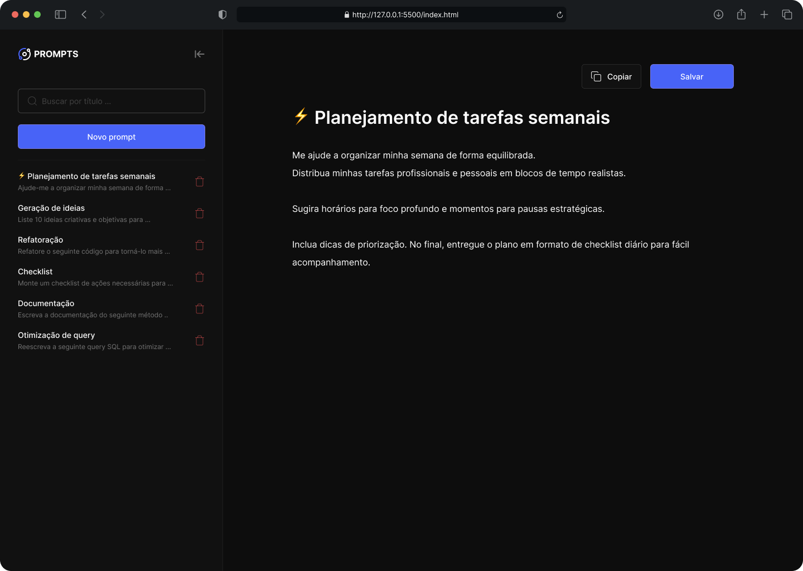
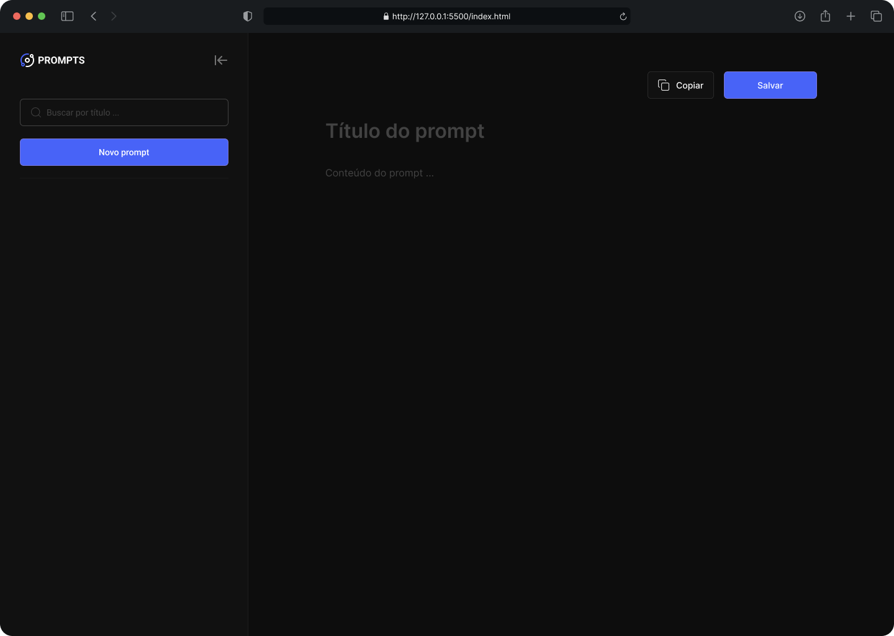
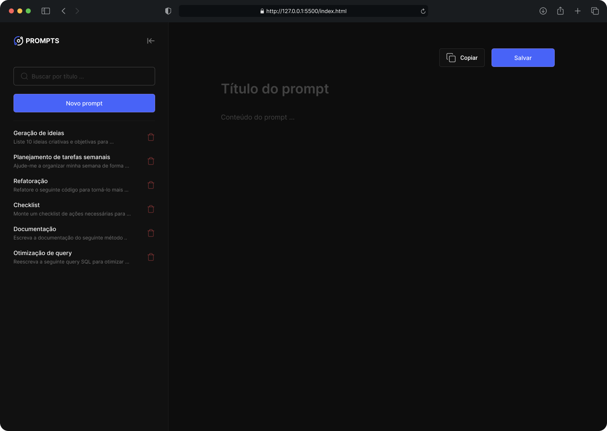

   

Uma aplicação web criada durante o **NLW Pocket Iniciantes (06/10 a 10/10)** da **Rocketseat**, com o objetivo de permitir o **armazenamento, organização e reutilização de prompts personalizados** para ChatGPT ou outras ferramentas de IA.

## 🧠 Sobre o projeto

O **PROMPTS** é uma aplicação simples e intuitiva desenvolvida com HTML, CSS e JavaScript puro, que permite ao usuário:

  * Criar novos prompts com título e conteúdo;
  * Editar e salvar prompts diretamente no navegador;
  * Copiar prompts para reutilização rápida;
  * Excluir prompts individualmente;
  * Pesquisar prompts pelo título;
  * Persistir os dados localmente no navegador (via LocalStorage).

Essa aplicação foi pensada para quem quer organizar suas ideias, manter uma biblioteca pessoal de prompts e aumentar a produtividade no uso de IAs generativas.

## 🧩 Funcionalidades

✅ Criar, editar e salvar prompts
✅ Copiar o conteúdo com um clique
✅ Pesquisar pelo título
✅ Excluir prompts
✅ Layout responsivo e moderno
✅ Tema escuro elegante com destaque visual para os elementos principais

## 🔗 Links

📘 [Acessar o layout no Figma](https://www.figma.com/community/file/1376289957921531482/prompts-nlw-pocket-rocketseat)

📚 [Acessar documentação do projeto](https://efficient-sloth-d85.notion.site/NLW-Pocket-Iniciantes-277395da57708037935accc37251061a)

🌐 [URL do projeto publicado](https://gelzieny.github.io/prompts-manager/)

## 🖥️ Tecnologias utilizadas

## 📸 Preview do Projeto

  
  
  
  

## 🧑‍💻 Autora

**Gelzieny R. Martins**  
Desenvolvedora Full Stack | Python, Django, JavaScript, DevOps  
💼 [LinkedIn](https://www.linkedin.com/in/gelzieny/)  
🌐 [Portfólio](#)

## 🏁 Evento

Projeto desenvolvido durante o **NLW Pocket — Iniciantes**, realizado de **06 a 10 de outubro de 2025** pela **Rocketseat**, com foco em **criar uma aplicação web do zero** usando tecnologias fundamentais da web.

## 📄 Licença

Este projeto está sob a licença **MIT**.  
Sinta-se à vontade para usar, estudar e modificar como desejar.